**Data Scientist | Data Analyst | AI/ML Enthusiast | Web Developer**

Integrated M.Sc. in **Quantitative Economics and Data Science** · **BIT Mesra** · **Expected Graduation: 2027**

 

  

  

 

## Featured projects

| Project | Focus | Repository |
|:---|:---|:---|
| **NoteVerse** | eBook platform | — |
| **Code Muscle** | Interactive coding practice platform | — |
| **Model Diagnoser** | Automated ML diagnostics and explanations | [View repository](https://github.com/SUJENPURTY/ai-model-diagnoser) |
| **AI Welfare Assistant** | Multilingual AI assistant for government welfare recommendations | [View repository](https://github.com/SUJENPURTY/AI-Government-Welfare-Assistant) |
| **Medical X-ray Segmentation** | Deep learning research | — |
| **Prosper P2P Loan Risk Prediction** | Machine learning for loan default prediction | [View repository](https://github.com/SUJENPURTY/P2P-Loan-Default-Predictor) |

Repository links are included where a matching public repository could be verified.

 

## GitHub insights

 

  

## Contribution activity

  

 

  

**Always learning, always building.**

